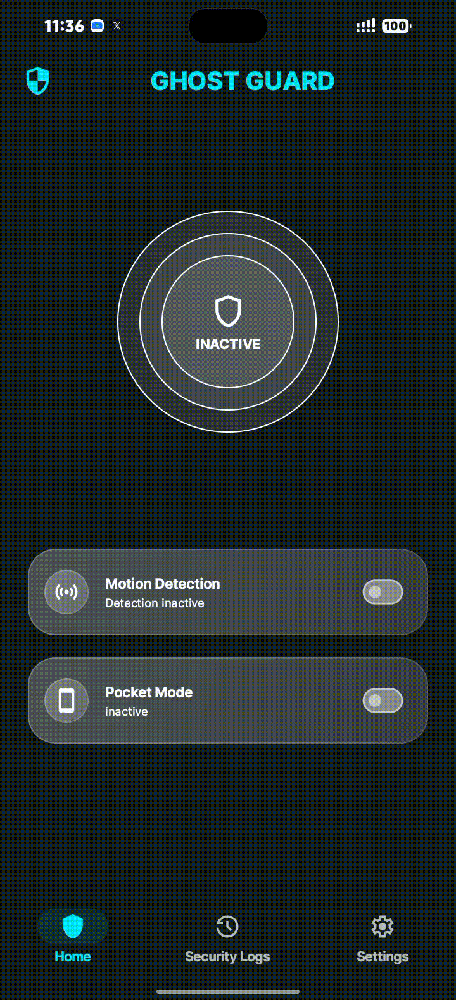

# Ghostguard 🛡️

**Ghostguard** is a lightweight, reliable security application built to protect your device 24/7 from phone snatchers and parents who just snatch their kids' phone. By leveraging the device's built-in accelerometer and proximity sensors, Ghostguard detects unauthorized movement or handling and instantly triggers security alerts.

---
## 📸 Visuals

---

## ✨ Features

* **24/7 Protection:** Keeps watch over your phone whenever it's left unattended or vulnerable.
* * **Motion Detection Switch:** A user-friendly toggle to easily arm or disarm the foreground security monitoring service.
* **Proximity Awareness:** Combines accelerometer data with proximity checks to prevent false alarms.
* * **Pocket Mode:** Uses the proximity sensor as a gatekeeper to detect when the device is pulled out of a pocket or bag, instantly triggering an alert against snatchers.
* **Security Event Logs:** Maintains a chronological history of detection events and timestamps using a local Room database.

---

## ⚙️ General Settings

* **Motion Sensitivity Control:** Features a customizable threshold slider to fine-tune how easily the security alarm triggers, set in settings.
* **Pocket Mode:** Features a customizable proximity toggle to detect when the device is pulled out of a pocket or bag, set in settings.
* **Flashlight Strobing:** Features a customizable toggle to enable flashing strobe lights when an alarm is triggered, set in settings.
* **Timer Countdown:** Features a customizable timer countdown value to control the delay before the alarm sounds, set in settings.

---

## 📐 How It Works: Motion Detection & Threshold Calculation

Ghostguard relies on real-time sensor data streaming from the device's accelerometer. To distinguish between normal placement and unauthorized movement, the app calculates the deviation of the device's acceleration magnitude from standard Earth gravity.

### 1. Acceleration Vector Magnitude
First, the app computes the total magnitude of acceleration across all three spatial axes:

$|A| = \sqrt{x^2 + y^2 + z^2}$

Where $x$, $y$, and $z$ represent the forces measured along each respective axis.

### 2. Variation Delta Calculation
Next, it determines the motion variation ($\Delta$) by calculating the absolute difference between the calculated magnitude and the standard Earth gravity constant ($9.81\text{ m/s}^2$):

$$\Delta = | |A| - 9.81 |$$

### 3. Threshold Validation & Sensitivity Slider
* **Validation Window:** If the computed variation $\Delta$ exceeds the user-defined threshold, the app opens a validation window to confirm that the movement is sustained rather than a brief, accidental bump.
* **Sensitivity Adjustment:** Users can adjust the detection sensitivity via a UI slider in the settings. The slider inverts the sensitivity value into a threshold, where a lower threshold value results in higher sensitivity to subtle movements.

---

## 🛠️ Tech Stack

## 🛠️ Tech Stack

* **Language:** [Kotlin](https://kotlinlang.org/)
* **UI Framework:** Jetpack Compose
* **Architecture:** Clean Architecture & MVVM (Model-View-ViewModel)
* **Dependency Injection:** Dagger Hilt
* **Database:** Room Database (for security event logs)
* **Android APIs:** `SensorManager` (Accelerometer & Proximity sensors), Foreground Service,

---

## 📄 License

This project is open-source and available under the [MIT License](LICENSE).
